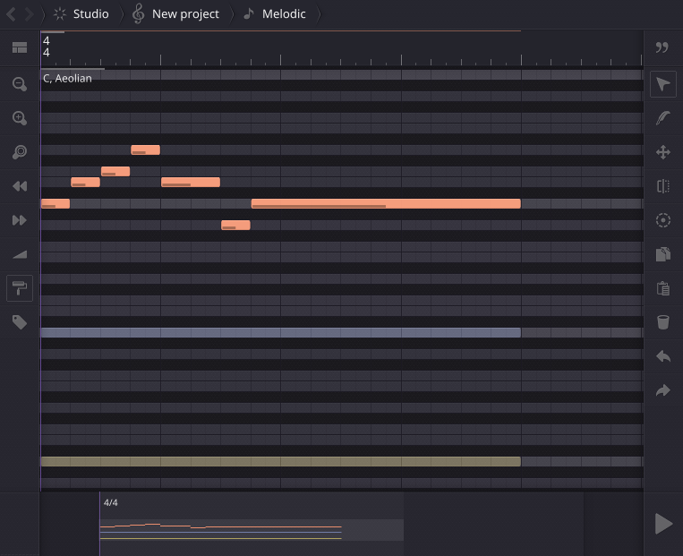
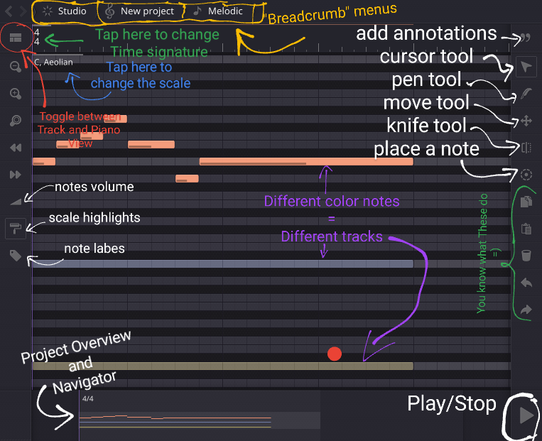
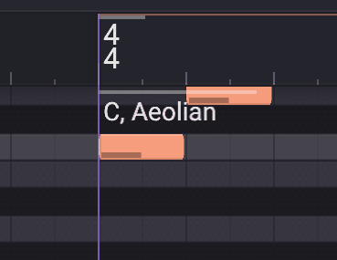

<h2/>Descriptions:</h2>
 This is an unoffical guide to help you 
 get the hang of Helios Workstation (HeW).

<i>As the project are under constant 
development, the infos in this guide are 
targeted at version <b>2.4</b> andmight 
not be accurate in other versions.
</i>

<h4>> Let's begin.</h4>
<p1>
So you open HeW for the first time and are 
greeted by this screen:
<!--insert screen here-->
 
This is HeW's piano roll, where you can edit 
the notes of your melody. 
<!--insert screenn w explainations-->
As you've noticed, an example project has been 
loaded.
<h4>>Explain the basic interface:</h4>
 
 

<h4>> Recover from confusing "help" picture</h4>
 You quickly recover from an eye soring, 
 apsolute abomination of poorly made atempts to
 explain the program's UI.
 Who ever made that must have been a master of 
 confusions. Or just really REALLY bad at making 
 tutorial.

<h4>> Try again, NO pictures this time</h4>
 So, the basics:
 
 * You place notes by double click (of tap) where 
 you want to place notes. Alternativly, you can use 
 the PEN TOOL (shortcut:"2") to place the notes and 
 , at the same time, adjust its' lenght.
    * Once you have place a not, you can chose to 
    make it a chord by 
    hexagon buttons
 
<i> noted: I have seen a bug in which the play 
head seems to not move in scyn with the notes 
being played. If it's the case, try the following:
 
 
 <ul>
 <li>On mobile: move any element (the track, note, 
etc.)pass the begining of the song, then move
it back.</li>
 <li>On PC: select the first note by left click 
on It, then press the the left arrow key. The 
note should extrude the begining of the song.
Then, move it back.</li>
</ul>
</i>
<h1>> Um, ok? How do I...</h1>

<h3> Input notes?</h3>
• 

